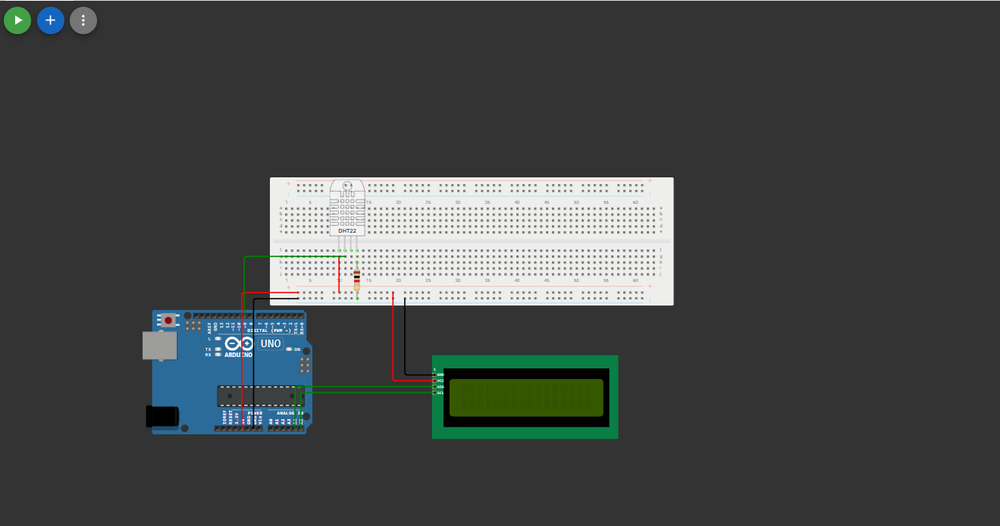
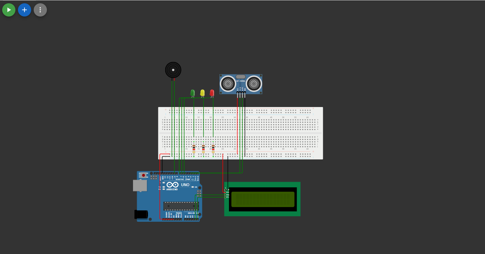

# GS-Edge-Computing
Repositório que servirá para armazenar o desenvolvimento do código em C++ para  a matéria Edge computing

# Descrição do 🚫problema🚫
Nossa ideia surge com o principal objetivo de evitar danos maiores em desastres, isso, que tem sido um desafio para o nosso país nas últimas décadas, como mostra a pesquisa realizada pela ONG "Movimento União BR" em conjunto á empresa especializada em analise de dados Nexus, nela, é dito que um a cada dez brasileiros sofreram de alguma maneira por desastres naturais.
O governo tem tentado de muitas maneiras combater a situação, porém vem falhando repetidas vezes, atém mesmo em casos muito similares, como o de Brumadinho e Mariana. Por isso, nossa ideia tenta ajudar não só a populção, mas também o estado e pesquisadores. Para assim, perdas com desastres naturais deixem de ser rotina, e se tornem exceção.

# Nossa 🌎solução🌎
Um portal para além de informarmos sobre o tempo atual e avisarmos a populção de eminentes catástrofes, também seja um lugar de recrutamneto de ajuda humanitária para a recontrução de comunidades, e um espaço para divulgação de instituições filantrópicas relacionadas a desastres climáticos. Fora ajudar a população, nossa ferramenta servirá como base de dados para que pesquisadores e orgãos estatais possam consultar o clima da região, assim podendo observar certos padrões, afinal de certas populões se prepararem melhor para potenciais chuvas, tempestades, enchentes e transbordamento de rios.

# Onde entra o Arduino nessa história

## ☔ 1.0 medidor de umidade capaz de indicar a chance de chuva ☔

    

Não tem muito segredo, apertar o botão de rodar e ver que a depender do nível de umidade no ar, que pode ser controlado pelo DHT22, O LCD emitirá diferentes mensagens, estás, sempre relacionadas as chances de chuva.

## ⚡ 2.0 medidor de nível da água ⚡

    

Novamente, apertar o botão de rodar, e ver que nessa simulação a depender do nível de água em um reservatório, que é medido por um sensor ultrassocino, Leds se acenderam a depender do nível de preocupação, sendo o verde o mais traquilo, e o vermelho o mais alarmante, este que é pariado á um buzzer quando a distância entre o nível da água e o sensor, é menor á 15 cm, e nesse caso, o LCD indicará que as autoridades já foram contatadas.

# links

- Projeto 1 - umidade no ar: [Clique aqui](https://wokwi.com/projects/432246713340609537)

- Projeto 2 - Nivel de água: [Clique aqui](https://wokwi.com/projects/432253035508079617)

- Video: [Clique aqui](https://youtu.be/TfUBKiSIXFI)